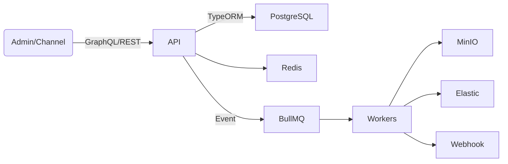

# CMS 架构蓝图

## 目标

- Headless + UI Builder，满足企业级内容分发、多租户与工作流。
- 可扩展、可观测，支持云原生部署与自动化。

## 组件

1. **API 层 (`apps/api`)**
   - NestJS 模块：Auth、Tenant、Content Model、Entry、Workflow、Media、Search、Automation
   - 技术栈：GraphQL + REST、TypeORM、PostgreSQL、Redis、BullMQ
   - 能力：模型定义（JSON Schema）、字段级权限、版本管理、Hook/Trigger

2. **管理后台 (`apps/admin`)**
   - Next.js + App Router，支持 SSR/SSG
   - 设计系统：Tailwind、Radix UI、Headless UI
   - 功能：模型构建器、内容编辑器、流程看板、系统设置、插件市场

3. **共享包 (`packages/core`, `packages/config`)**
   - `@cms/core`：类型、API SDK、工作流状态机、校验器
   - `@cms/config`：集中式配置加载（dotenv + zod）

4. **基础设施 (`infrastructure`)**
   - `docker-compose.yml`：PostgreSQL、Redis、MinIO、Elastic、Traefik、Tempo
   - `helm/`：生产环境 Helm Chart 草案
   - `scripts/`：数据库迁移、数据种子、索引构建

## 数据流

## 安全与治理

- AuthN：Keycloak/OAuth2、API Token、JWT、SSO
- AuthZ：RBAC + ABAC + Scope，字段级策略
- 审计：操作日志、内容变更 Diff、IP/UA 记录
- 合规：数据加密（KMS）、PII 分级、备份策略

## 路线图

1. MVP：内容模型 + 工作流 + 权限 + 媒体 + API
2. 增强：自动化（Webhooks、Scheduler）、搜索、插件
3. 企业：多租户隔离、SLA、Observability、Insights
4. 生态：插件市场、Design System、SDK、多语言站点生成

